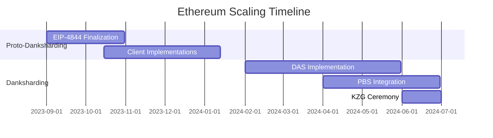

# Understanding Ethereum's Latest Technical Roadmap: Rollup-Centric Strategy and Sharding as the Development Focus

## Introduction to Ethereum's Evolving Architecture

Ethereum's journey from its 2015 inception to today's sophisticated framework reveals a dynamic evolution shaped by technological innovation and community consensus. The network's transition from proof-of-work (PoW) to proof-of-stake (PoS) through "The Merge" marked a pivotal moment, setting the stage for its next evolutionary phase focused on scalability and efficiency.

### Core Components of Ethereum's Roadmap

The current roadmap comprises three critical elements:
1. **Beacon Chain**: The foundation of Ethereum's PoS mechanism since December 2020
2. **The Merge**: Successful integration of execution and consensus layers across testnets
3. **Sharding**: The upcoming priority for 2023 and beyond

**Keyword Focus**: Ethereum, blockchain scalability, proof-of-stake

### The Rollup-Centric Paradigm Shift

Vitalik Buterin's 2020 vision of a Rollup-centric Ethereum redefined the network's purpose:
- **Data Availability Layer**: Ethereum's primary role becomes ensuring transaction data security
- **Decentralized Infrastructure**: Supporting multiple Rollup implementations simultaneously
- **Simplified Base Layer**: Focusing on data storage rather than complex computation

This strategic pivot recognizes Rollups' proven effectiveness in reducing transaction costs while maintaining security through Ethereum's settlement layer.

👉 [Discover Ethereum's future potential](https://bit.ly/okx-bonus)

---

## Technical Deep Dive: From Traditional Sharding to Danksharding

### Original Sharding Architecture (2015-2020)

The initial proposal featured:
- **64 Independent Shards**: Each with dedicated proposers and committees
- **Validator Groups**: Minimum 128 validators per shard committee
- **Cross-Chain Communication**: Through validator management contracts (VMC)

This model aimed to parallelize transaction processing but introduced complexity through multiple consensus layers.

### Emergence of Danksharding

The modern approach introduces three groundbreaking innovations:
1. **Data Availability Sampling (DAS)**
2. **Proposer-Builder Separation (PBS)**
3. **Anti-Censorship Mechanisms**

**Keyword Focus**: Danksharding, blockchain scalability, data availability

### Proto-Danksharding (EIP-4844): The Transitional Phase

Key features:
- **Blob-Carrying Transactions**: 125kB data blocks vs traditional 10kB CALLDATA
- **Temporary Storage**: Blobs retained for 30 days before deletion
- **Storage Burden Reduction**: Annual growth limited to 2.5TB vs potential 175TB permanence

This intermediate solution provides immediate transaction fee reductions while preparing for full Danksharding implementation.

---

## Core Innovations in Ethereum's Scaling Strategy

### Data Availability Sampling (DAS)

**Technical Breakthroughs**:
- **Erasure Coding**: Reed-Solomon implementation ensures data reconstructability with 50% availability
- **KZG Polynomial Commitments**: Enables efficient verification of data integrity
- **2D KZG Framework**: Further optimizes node workload distribution

**Performance Impact**:
| Metric                | Traditional Model | Danksharding      |
|-----------------------|-------------------|-------------------|
| Data Verification Time| O(n)              | O(√n)             |
| Storage Requirements  | 100% permanence   | 30-day retention  |
| Security Assumption   | N/2 honest nodes  | 1-of-N honesty    |

### Proposer-Builder Separation (PBS)

**Structural Changes**:
- **Specialized Roles**: 
  - Builders optimize MEV extraction
  - Proposers select highest-bid blocks
- **Hardware Requirements**:
  - Builders: 32-64 core CPUs, 2.5Gbps bandwidth
  - Proposers: Standard validator hardware

**Economic Impact**:
- **MEV Redistribution**: From centralized pools to all validators
- **Security Enhancement**: 30% reduction in MEV-induced centralization

👉 [Explore blockchain innovations](https://bit.ly/okx-bonus)

---

## Frequently Asked Questions

**Q: How does Ethereum's sharding differ from traditional database sharding?**  
A: Unlike traditional systems, Ethereum's approach prioritizes security and decentralization over pure throughput, using cryptographic techniques like DAS and KZG commitments to maintain trustless verification.

**Q: What makes Danksharding superior to original sharding proposals?**  
A: Danksharding reduces complexity by 85% through unified committees while improving data availability guarantees. It also enables cross-shard composability through synchronous calls.

**Q: How does PBS affect everyday users?**  
A: By democratizing MEV rewards and preventing builder monopolies, PBS maintains network decentralization which directly protects user transaction finality and censorship resistance.

**Q: What happens if all blob storage providers fail?**  
A: The 1-of-N trust assumption ensures system viability as long as at least one honest participant maintains data backups during the 30-day window.

---

## The Future Landscape: Multi-Rollup Ecosystem

### Emerging Infrastructure Requirements

1. **Cross-Rollup Bridges**: Essential for asset movement and liquidity sharing
2. **Standardized Communication Protocols**: Enabling seamless interoperability
3. **Distributed Oracles**: Providing trusted data feeds across chains

**Projected Market Impact**:
| Metric                  | 2023 Estimate | 2025 Projection |
|-------------------------|---------------|-----------------|
| Active Rollup Chains    | 35            | 150+            |
| Cross-Rollup Transactions | 1.2M/day      | 15M+/day        |
| Total Value Secured     | $28B          | $200B+          |

### Economic Implications

**Transaction Cost Reduction**:
- **Optimistic Rollups**: 5-10x cheaper than L1
- **ZK-Rollups**: 40-100x cheaper with further potential through Danksharding

**Validator Revenue Streams**:
1. Staking Rewards
2. MEV Auction Proceeds
3. Blob Transaction Fees

---

## Strategic Outlook and Development Timeline

### Implementation Roadmap

- **Q4 2023**: Proto-Danksharding (EIP-4844) activation
- **Q2 2024**: Full Danksharding with DAS and PBS
- **2025**: Enhanced cross-Rollup composability features

**Development Milestones**:

### Long-Term Vision

1. **Decentralized Infrastructure Layer**: Ethereum as the base security layer
2. **Application-Specific Rollups**: Tailored environments for DeFi, NFTs, and Web3
3. **Global Settlement Network**: Enabling instant finality across financial systems

---

## Conclusion: Ethereum's Evolutionary Path

The transformation from a monolithic blockchain to a modular architecture represents Ethereum's most significant evolution since its inception. By embracing Rollup-centric design and innovative sharding techniques, the network positions itself as the foundation for Web3's next decade.

**Strategic Implications**:
- **Developer Ecosystem**: Attracting builders with flexible execution environments
- **Enterprise Adoption**: Through predictable scaling and reduced transaction costs
- **Regulatory Compliance**: Enhanced transparency through verifiable data availability

👉 [Join Ethereum's future ecosystem](https://bit.ly/okx-bonus)

This architectural shift doesn't just improve technical metrics—it redefines blockchain's role in digital infrastructure, creating a more scalable, secure, and accessible decentralized web.